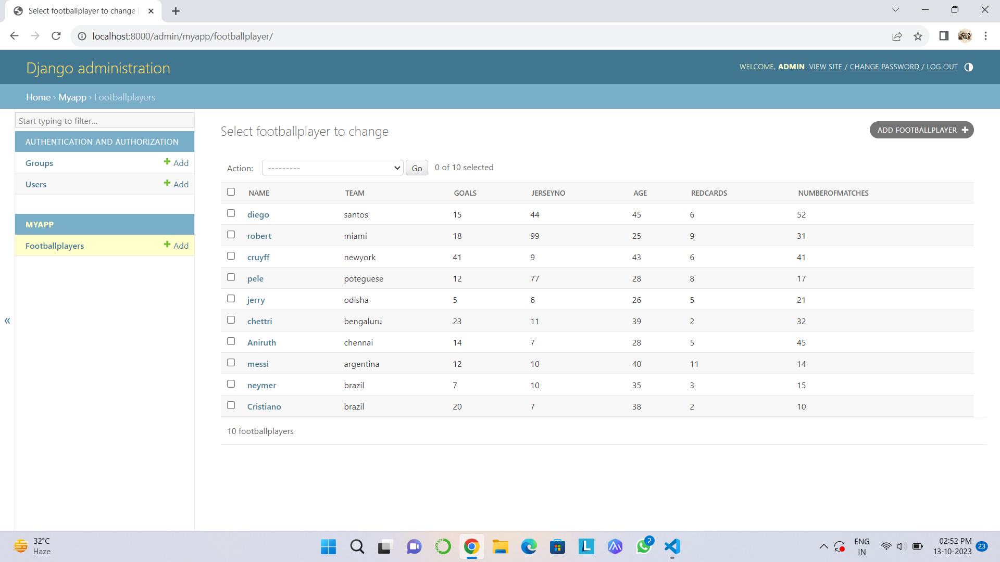

# Ex02 Django ORM Web Application
## Date: 18-10-2023

## AIM
To develop a Django application to store and retrieve data from a Football Players database using Object Relational Mapping(ORM).

## DESIGN STEPS

### STEP 1:
Clone the problem from GitHub

### STEP 2:
Create a new app in Django project

### STEP 3:
Enter the code for admin.py and models.py

### STEP 4:
Execute Django admin and create 10 Football players

## PROGRAM
``````
# Register your models here.
from django.contrib import admin
from .models import footballplayer,footballplayerAdmin
admin.site.register(footballplayer,footballplayerAdmin) 
``````   
``````
from django.db import models
from django.contrib import admin
class footballplayer(models.Model):
    name=models.CharField(max_length=10)
    team=models.CharField(max_length=15)
    goals=models.IntegerField()
    jerseyno=models.IntegerField()
    age=models.IntegerField()
    redcards=models.IntegerField()
    numberofmatches=models.IntegerField()
class footballplayerAdmin(admin.ModelAdmin):
    list_display=["name","team","goals","jerseyno","age","redcards","numberofmatches"]
``````
## OUTPUT




## RESULT
Thus the program for creating a database using ORM has been executed successfully
